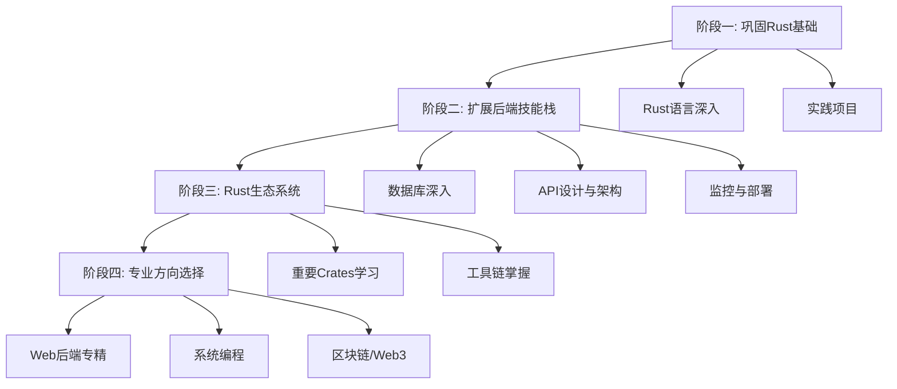

# Rust 后端开发学习路线规划

> 🎯 **目标受众**：完成 `zero2prod` 项目的前端转后端开发者  
> ⏰ **总时长预估**：6-8个月  
> 📅 **制定时间**：2025年

## 📋 学习路线总览



---

## 🚀 阶段一：巩固 Rust 基础 (1-2个月)

### 📚 学习目标
- [ ] 深入理解 Rust 核心概念
- [ ] 能够独立编写中等复杂度的 Rust 程序
- [ ] 掌握 Rust 异步编程模式

### 📖 学习内容

#### 1.1 Rust 语言深入学习 (3-4周)

| 知识点 | 学习资源 | 确认方式 | 预计时间 |
|--------|----------|----------|----------|
| 所有权、借用、生命周期 | 《The Rust Programming Language》Ch 4-10 | 完成官方练习 + 自测题 | 1周 |
| 错误处理模式 | 《The Rust Programming Language》Ch 9 | 实现自定义错误类型 | 3天 |
| 泛型、特征、宏 | 《The Rust Programming Language》Ch 10,19 | 编写通用数据结构 | 1周 |
| 并发编程 | Tokio Tutorial 官方教程 | 实现并发网络服务 | 1周 |

#### 1.2 实践项目 (2-3周)

**项目一：命令行工具** (1周)
- [ ] 使用 `clap` 构建 CLI 应用
- [ ] 实现文件处理功能
- [ ] 添加配置文件支持
- **确认标准**：能处理命令行参数、读写文件、错误处理

**项目二：算法练习** (1周)  
- [ ] 在 LeetCode 上用 Rust 解决 20+ 题目
- [ ] 涵盖数组、链表、树、图等数据结构
- **确认标准**：熟练使用 Rust 语法解决算法问题

**项目三：优化 zero2prod** (1周)
- [ ] 重构代码结构
- [ ] 添加新的 API 端点
- [ ] 改进错误处理
- **确认标准**：代码质量提升，功能扩展

### ✅ 阶段一完成标准
- [ ] 能够独立阅读并理解中等复杂度的 Rust 代码
- [ ] 掌握 Rust 所有权系统，编译错误数量显著减少
- [ ] 能够使用异步编程模式构建简单的网络应用
- [ ] 完成上述三个实践项目

---

## 🛠️ 阶段二：扩展后端技能栈 (2-3个月)

### 📚 学习目标
- [ ] 掌握数据库设计和优化
- [ ] 理解 API 设计最佳实践
- [ ] 具备基本的 DevOps 能力

### 📖 学习内容

#### 2.1 数据库深入 (3-4周)

| 技术栈 | 学习内容 | 实践项目 | 确认方式 | 时间 |
|--------|----------|----------|----------|------|
| PostgreSQL | 索引设计、查询优化、事务 | 设计复杂查询系统 | 通过 EXPLAIN 分析查询计划 | 2周 |
| Redis | 缓存策略、发布订阅、分布式锁 | 实现缓存层 | 搭建 Redis 集群 | 1周 |
| 数据库设计 | 迁移、种子数据、备份 | 设计用户权限系统 | 编写数据库迁移脚本 | 1周 |

#### 2.2 API 设计与架构 (3-4周)

| 概念 | 学习资源 | 实践内容 | 确认标准 | 时间 |
|------|----------|----------|----------|------|
| RESTful API | REST API 设计指南 | 设计完整的 REST API | API 符合 REST 规范 | 1周 |
| GraphQL | async-graphql 文档 | 实现 GraphQL 服务 | 支持查询、变更、订阅 | 2周 |
| 微服务基础 | 微服务架构模式 | 拆分单体应用 | 服务间通信正常 | 1周 |

#### 2.3 监控与部署 (2-3周)

| 技能 | 工具/技术 | 实践目标 | 确认方式 | 时间 |
|------|-----------|----------|----------|------|
| 可观测性 | tracing, metrics | 添加日志和指标 | 能够监控应用性能 | 1周 |
| 容器化 | Docker, docker-compose | 容器化应用 | 能够一键部署 | 1周 |
| CI/CD | GitHub Actions | 自动化部署 | 代码提交自动部署 | 1周 |

### ✅ 阶段二完成标准
- [ ] 能够设计和优化数据库结构
- [ ] 掌握 REST 和 GraphQL API 设计
- [ ] 具备基本的监控和部署能力
- [ ] 完成一个包含多个服务的完整项目

---

## 📚 阶段三：Rust 生态系统 (1-2个月)

### 📚 学习目标
- [ ] 熟练使用 Rust 生态系统核心库
- [ ] 掌握 Rust 开发工具链
- [ ] 能够选择合适的第三方库

### 📖 学习内容

#### 3.1 重要 Crates 学习 (3-4周)

**Web 框架生态**
```toml
# 在 Cargo.toml 中添加以下依赖并学习使用
[dependencies]
# Web 框架
axum = "0.7"              # 学习现代化 Web 框架
tower = "0.4"             # 中间件和服务抽象
tower-http = "0.5"        # HTTP 中间件

# 数据库 ORM
sea-orm = "0.12"          # 现代 ORM
sqlx = "0.7"              # 已熟悉，继续深入

# 序列化
serde = "1.0"             # JSON/YAML 处理
serde_json = "1.0"

# 异步运行时
tokio = "1.0"             # 深入学习

# 错误处理
anyhow = "1.0"            # 简化错误处理
thiserror = "1.0"         # 自定义错误类型

# 测试
rstest = "0.18"           # 参数化测试
```

**学习计划**
| Crate | 学习重点 | 实践项目 | 确认标准 | 时间 |
|-------|----------|----------|----------|------|
| axum | 路由、中间件、提取器 | 重写 zero2prod 使用 axum | 功能等价 | 1周 |
| sea-orm | 实体、迁移、关系 | 使用 ORM 重构数据层 | 代码更简洁 | 1周 |
| tower | 服务、层、中间件 | 自定义中间件 | 实现限流中间件 | 1周 |
| 测试工具 | 单元测试、集成测试 | 提高测试覆盖率 | 覆盖率 >80% | 1周 |

#### 3.2 工具链掌握 (1-2周)

| 工具 | 用途 | 学习内容 | 确认方式 | 时间 |
|------|------|----------|----------|------|
| Cargo | 包管理 | 工作空间、发布、自定义命令 | 发布一个 crate | 3天 |
| Clippy | 静态分析 | 代码质量检查 | 零警告通过 | 2天 |
| rustfmt | 代码格式化 | 代码风格统一 | 配置团队规范 | 1天 |
| cargo-watch | 自动重编译 | 开发效率提升 | 集成到开发流程 | 1天 |
| cargo-audit | 安全检查 | 依赖安全审计 | 定期安全检查 | 1天 |

### ✅ 阶段三完成标准
- [ ] 能够快速选择和使用合适的第三方库
- [ ] 熟练使用 Rust 开发工具链
- [ ] 能够发布和维护自己的 crate
- [ ] 建立了完整的开发工作流

---

## 🎯 阶段四：专业方向选择 (持续学习)

### 方向一：Web 后端专精 🌐

**学习路径 (3-4个月)**

| 技术领域 | 核心技能 | 学习资源 | 实践项目 | 时间 |
|----------|----------|----------|----------|------|
| 高性能服务 | 性能优化、负载测试 | 《Systems Performance》 | 高并发 API 服务 | 1个月 |
| 分布式系统 | 一致性、可用性、分区容错 | 《Designing Data-Intensive Applications》 | 分布式缓存系统 | 1个月 |
| 消息队列 | RabbitMQ, Apache Kafka | 官方文档 + 实践 | 消息处理系统 | 1个月 |
| 搜索引擎 | Elasticsearch | Elastic 官方文档 | 全文搜索 API | 1个月 |

**进阶项目**
- [ ] 构建微服务架构的电商后端
- [ ] 实现分布式任务调度系统  
- [ ] 开发实时数据处理管道

### 方向二：系统编程 ⚡

**学习路径 (3-4个月)**

| 技术领域 | 核心技能 | 学习资源 | 实践项目 | 时间 |
|----------|----------|----------|----------|------|
| 网络编程 | TCP/UDP, HTTP/2, WebSocket | 《Rust in Action》 | 网络代理服务器 | 1个月 |
| 操作系统 | 进程、线程、内存管理 | 《Operating Systems Concepts》 | 简单操作系统内核 | 1个月 |
| 性能优化 | profiling, benchmarking | Rust Performance Book | 高性能计算库 | 1个月 |
| 嵌入式开发 | no_std, embedded-hal | 《The Embedded Rust Book》 | IoT 设备固件 | 1个月 |

**进阶项目**
- [ ] 实现一个简单的数据库引擎
- [ ] 开发网络协议解析器
- [ ] 构建高性能代理服务器

### 方向三：区块链/Web3 🔗

**学习路径 (3-4个月)**

| 技术领域 | 核心技能 | 学习资源 | 实践项目 | 时间 |
|----------|----------|----------|----------|------|
| 区块链基础 | 密码学、共识算法 | 《Mastering Bitcoin》 | 简单区块链实现 | 1个月 |
| 智能合约 | Solidity, Move | Solana/Aptos 文档 | DeFi 协议开发 | 1个月 |
| Solana 生态 | Anchor 框架 | Anchor Book | NFT 市场 | 1个月 |
| Web3 基础设施 | 钱包集成、节点运行 | Web3.js 文档 | 去中心化应用 | 1个月 |

**进阶项目**
- [ ] 开发去中心化交易所 (DEX)
- [ ] 实现跨链桥协议
- [ ] 构建 DeFi 聚合器

---

## 📈 学习进度追踪

### 每日学习计划
```markdown
## 日期：____

### 今日目标
- [ ] 学习目标1
- [ ] 学习目标2  
- [ ] 实践项目进度

### 学习内容
- **理论学习**：____
- **实践编码**：____
- **问题记录**：____

### 明日计划
- [ ] ____
```

### 每周回顾模板
```markdown
## 第 __ 周回顾

### 完成情况
- ✅ 已完成：____
- ⏳ 进行中：____
- ❌ 未完成：____

### 遇到的问题
1. 问题描述
   - 解决方案：____

### 下周计划
- [ ] ____
```

### 阶段性评估

**技能自评表** (1-5分)
| 技能领域 | 阶段一后 | 阶段二后 | 阶段三后 | 阶段四后 |
|----------|----------|----------|----------|----------|
| Rust 语法 | ___ | ___ | ___ | ___ |
| 异步编程 | ___ | ___ | ___ | ___ |
| 数据库设计 | ___ | ___ | ___ | ___ |
| API 设计 | ___ | ___ | ___ | ___ |
| 系统架构 | ___ | ___ | ___ | ___ |
| 性能优化 | ___ | ___ | ___ | ___ |
| DevOps | ___ | ___ | ___ | ___ |

---

## 🔧 开发环境配置

### 必备工具清单
```bash
# Rust 工具链
rustup update
cargo install cargo-watch
cargo install cargo-audit  
cargo install cargo-edit
cargo install cargo-expand

# 数据库工具
brew install postgresql
brew install redis

# 容器化工具  
brew install docker
brew install docker-compose

# 其他工具
brew install httpie      # API 测试
brew install jq          # JSON 处理
```

### VS Code 扩展推荐
- rust-analyzer
- Even Better TOML
- REST Client
- Docker
- PostgreSQL Explorer

---

## 📚 学习资源汇总

### 必读书籍
1. **《The Rust Programming Language》** - Rust 官方书籍
2. **《Programming Rust》** - O'Reilly 出版
3. **《Rust in Action》** - 系统编程实践
4. **《Zero To Production In Rust》** - 已完成 ✅
5. **《Designing Data-Intensive Applications》** - 分布式系统

### 在线资源
- [Rust by Example](https://doc.rust-lang.org/rust-by-example/)
- [Tokio Tutorial](https://tokio.rs/tokio/tutorial)
- [Rust Performance Book](https://nnethercote.github.io/perf-book/)
- [Rust API Guidelines](https://rust-lang.github.io/api-guidelines/)

### 社区资源
- [Rust 官方论坛](https://users.rust-lang.org/)
- [r/rust Reddit](https://www.reddit.com/r/rust/)
- [Rust 中文社区](https://rustcc.cn/)
- [This Week in Rust](https://this-week-in-rust.org/)

### YouTube 频道
- Jon Gjengset (Rust streams)
- Ryan Levick (Rust tutorials)
- No Boilerplate (Rust concepts)

---

## 🎯 项目 Portfolio 建议

### 必做项目 (展示不同技能)
1. **博客系统** - 展示 Web 开发能力
2. **聊天应用** - 展示实时通信能力  
3. **API 网关** - 展示系统设计能力
4. **CLI 工具** - 展示工具开发能力
5. **性能测试工具** - 展示性能优化能力

### GitHub Profile 优化
- [ ] 完善 README.md
- [ ] 添加项目演示 GIF
- [ ] 编写详细的项目文档
- [ ] 添加性能测试结果
- [ ] 包含技术栈说明

---

## ⚠️ 常见陷阱与建议

### 学习陷阱
1. **过度追求完美** - 先完成再完美
2. **跳跃学习** - 按阶段循序渐进  
3. **只看不练** - 理论与实践并重
4. **孤立学习** - 积极参与社区

### 成功建议
1. **项目驱动** - 每个阶段都要有实际产出
2. **持续重构** - 随着理解加深改进代码
3. **性能意识** - 始终关注性能和可扩展性
4. **文档优先** - 养成写文档的习惯
5. **测试先行** - TDD 开发模式

---

## 📞 学习支持

### 遇到问题时的求助顺序
1. **Google + Stack Overflow** - 搜索已知问题
2. **官方文档** - 查阅权威资料
3. **Rust 社区** - 询问具体问题
4. **GitHub Issues** - 查看相关项目问题
5. **技术导师** - 寻求一对一指导

### 学习记录建议
- 维护学习笔记仓库
- 记录踩坑经验
- 整理代码片段
- 定期技术总结

---

**祝你学习顺利！记住：坚持实践，持续改进，你一定能成为优秀的 Rust 后端工程师！** 🚀

---

*最后更新：2025年*  
*版本：v1.0* 